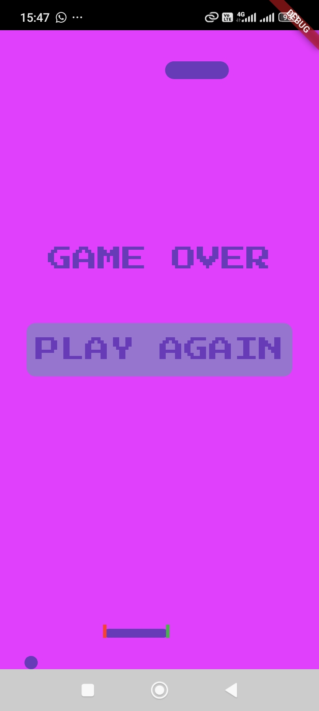
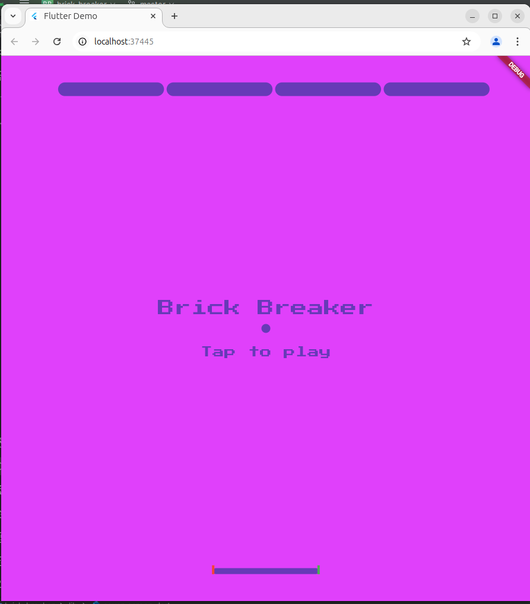

# Brick Breaker

A modern Flutter implementation of the classic Brick Breaker arcade game. Play on web or mobile with responsive design and retro pixel-perfect graphics.


## 📱 Screenshots

<div align="center">
  <div style="display: flex; flex-direction: row;">
    

  </div>

  <p><em>Mobile Experience</em></p>

  

  <p><em>Web Experience</em></p>
</div>

## ✨ Features

- 🎮 Classic Brick Breaker gameplay with modern touches
- 📱 Responsive design for both web and mobile platforms
- 🎨 Retro pixel art style with Google Fonts integration


## 🚀 Getting Started

### Prerequisites

- Flutter SDK (2.10.0 or higher)
- Dart SDK (2.16.0 or higher)
- Android Studio / VS Code / IntelliJ IDEA

### Installation

1. Clone the repository
```bash
git clone https://github.com/yourusername/brick-breaker.git
```

2. Navigate to the project directory
```bash
cd brick-breaker
```

3. Install dependencies
```bash
flutter pub get
```

4. Run the application
```bash
flutter run
```

## 🎮 How to Play

- **Web**: Use left and right arrow keys to move the paddle
- **Mobile**: Tap left or right side of the screen to move the paddle
- Break all bricks to advance to the next level
- Don't let the ball fall below the paddle!


## 📞 Contact

Your Name - [@yourusername](https://twitter.com/yourusername)

Project Link: [https://github.com/yourusername/brick-breaker](https://github.com/yourusername/brick-breaker)

## 🙏 Acknowledgments

- Original Brick Breaker game by Atari
- [Mitch koko,pls follow him on youtube](https://youtu.be/RToIapK2Cj8?si=oqp3tkAbp2bJ0gkZ)

---

<div align="center">
  <sub>Built with ❤️ by Your Name</sub>
</div>